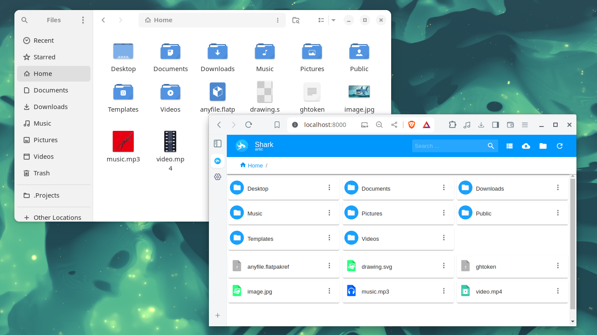

# Shark

Shark is a versatile desktop application available across multiple platforms (Windows, macOS, and Linux) that transforms your computer into a personal cloud storage solution. With Shark, you can effortlessly store, access, and manage your files directly from any device.



For more detailed information, refer to the [documentation](docs/README.md) directory.


### Run shark
To run Shark, use the command:

```shell
# Install dependencies (if you haven't already)
npm install

# Start Shark in development mode
npm run start
```