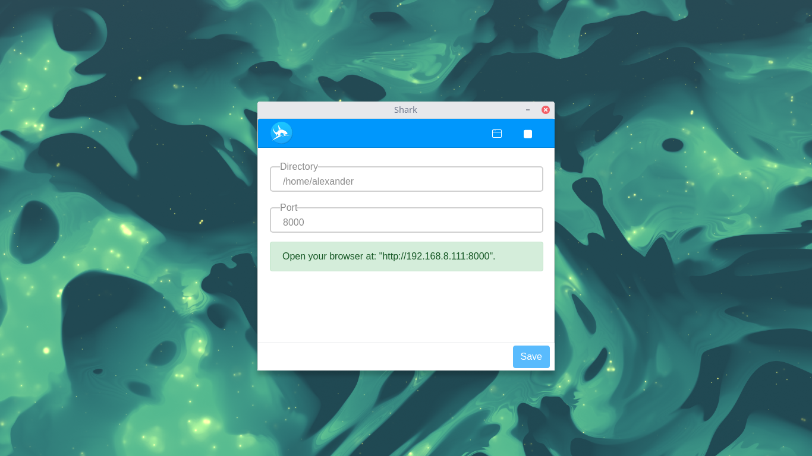
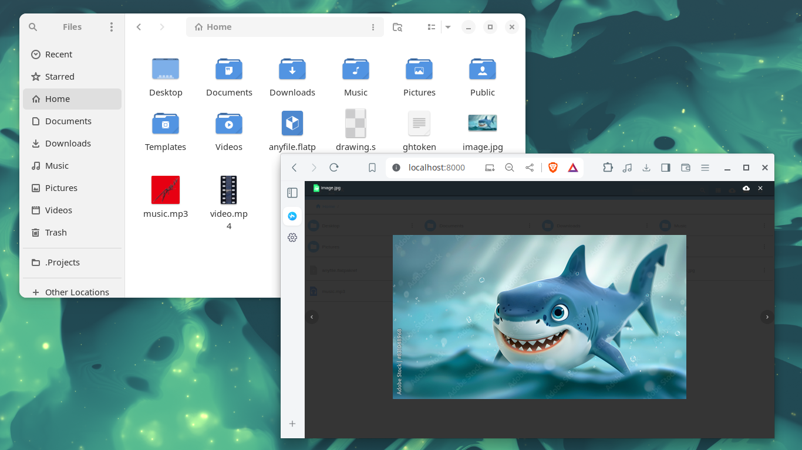
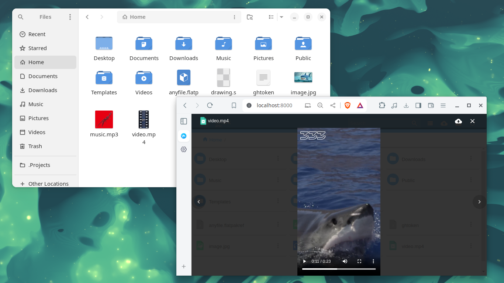
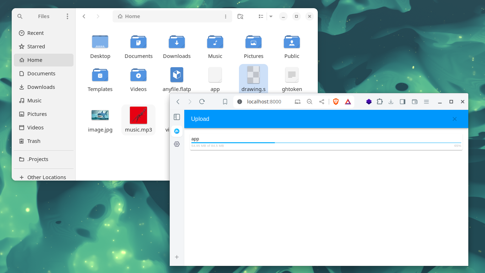
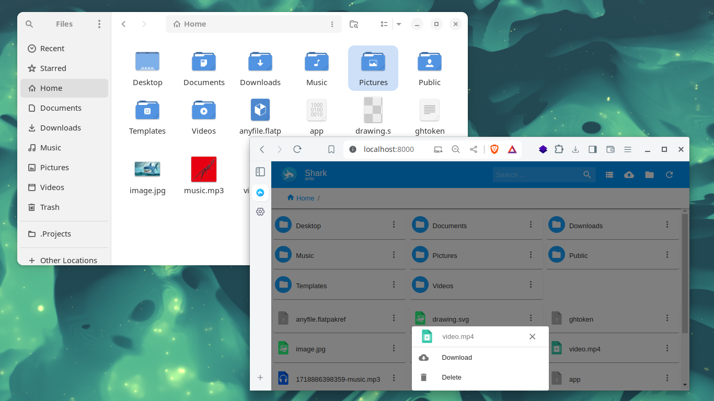

# Getting Started with Shark

## Launcher

The launcher image represents the starting point of Shark, where users can initiate the application on their desktop.

## Client Interface

The client interface screenshot showcases Shark's user-friendly desktop interface, designed for intuitive navigation and control.

## Preview Image

This image displays Shark's capability to preview images directly within the application, providing users with quick access to view their stored images.

## Preview Video

Shark allows users to preview videos seamlessly within the application interface, ensuring smooth playback and easy access.

## Upload Functionality

Shark's upload functionality is versatile, allowing users to upload any type of file to their personal cloud storage from the desktop environment. Whether it's documents, images, videos, or other file formats, Shark supports seamless file transfer for comprehensive storage management.

## Options Menu

ShaWithin Shark's options menu, users can manage their files with the following functionalities:
- **Download**: Easily retrieve files from Shark to your local device.
- **Delete**: Remove unwanted files securely from your personal cloud storage.

This menu provides essential controls for organizing and maintaining your data within the application.